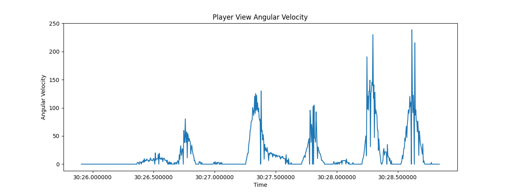
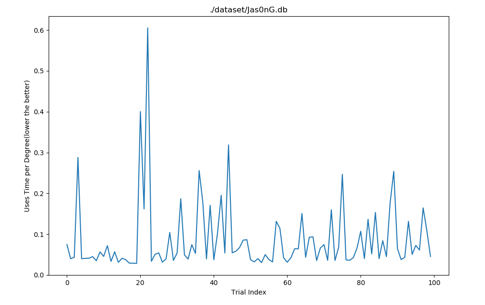

# FPSci_Analysis
  本项目是对FPSci的数据进行分析的项目，主要是对FPSci的数据进行统计分析与可视化处理。

## DEMO 1
绘制瞄准角速度与时间的曲线，用于分析瞄准速度的变化趋势。
Usage:
  ```shell
  python velocity.py $dataset
  ```
  


## DEMO2
计算目标与瞄准起点的夹角，并结合瞄准时间计算瞄准速度。绘制曲线代表在每一次测试中，每移动1°所需要的时间。

Usage:
  ```shell
  python dataProcesser.py $dataset
  ```

